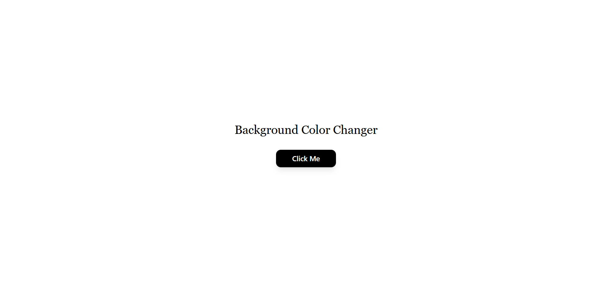
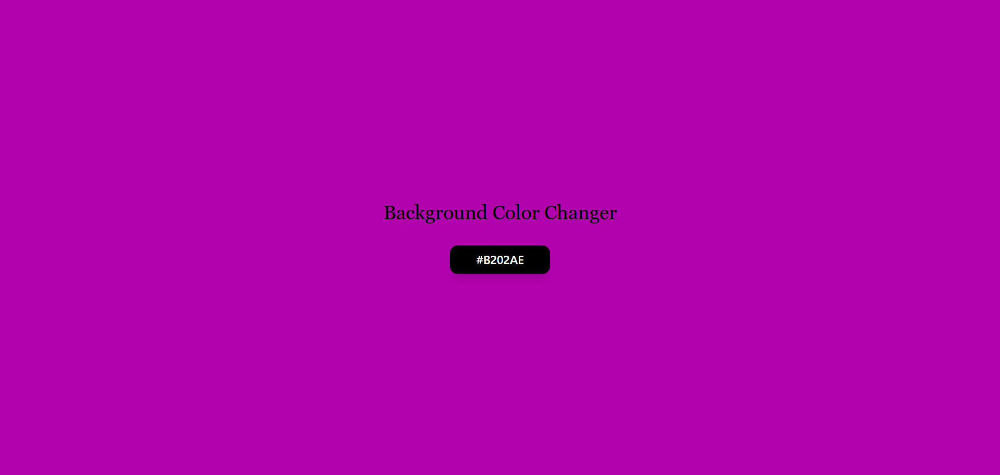
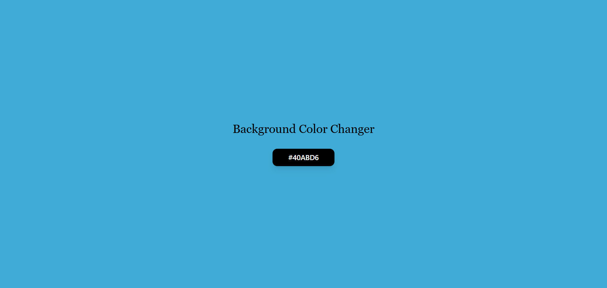

# Background Color Changer

 A minimalist web project that allows users to change the background color of the webpage with a single click. The button also updates its color and the heading color dynamically to match the new background color. Built using HTML, Tailwind CSS, and JavaScript.

### 🖥️ Demo

 * Click the “Click Me” button to randomly change the background color, button color, and heading color.

* The HEX color code is displayed below the button (optional).

###  🛠️ Features

* Minimalist design with only a heading and a button.

* Responsive layout using Tailwind CSS.

* Smooth transitions for background and button colors.

* Button click animation: hover and active effects.

* Optional HEX color display below the button.

#### 📂 Project Structure

| File / Folder       | Type          | Description                                         |
|--------------------|---------------|-----------------------------------------------------|
| `index.html`        | File          | Main HTML page with Tailwind CSS and the button.   |
| `button.js`         | File          | JavaScript logic for random background and button colors. |
| `README.md`         | File          | Project documentation and instructions.           |
| `demo-button.png`   | File (Optional)| Screenshot of the button for demo purposes.       |

### ⚡ Technologies Used

* HTML5 – Structure of the webpage

* Tailwind CSS – Styling and responsive layout

* JavaScript – Generate random colors and update elements dynamically

### 💻 How to Use

1. Clone or download the repository.

2. Open index.html in your browser.

3. Click the “Click Me” button to change the background color.

4. Optionally, you can display the color code below the button.

### 🔧 Customization

* Button size / color – Modify Tailwind classes in the <button> element.

* Heading alignment – Change text-left or text-center in Tailwind.

* Color code display – Update button.js to show or hide the HEX color.

* Glow / gradient effects – Add Tailwind utilities like bg-gradient-to-r or shadow-[color].

### 🎨 Future Enhancements

* Gradient color transitions

* Copy color code on click

* Neon / glowing button effects

* Dark / light mode toggle

### 📜 License

This project is free to use and modify.

